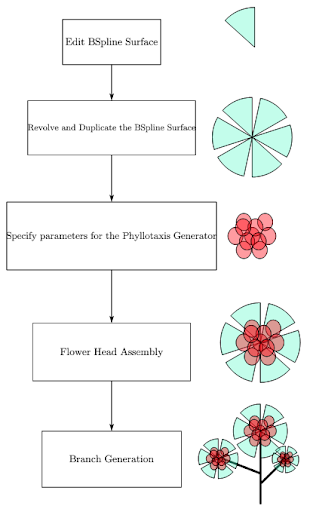

# BlossomPro
BlossomPro is a Maya Plugin that allows you to quickly prototype/ model flowers.

It is a toolset that consists of the following editors:
1. B-Spline Surface Editor (for modeling flower petals)
2. Phyllotaxis Generator (for generating [phllotactic patterns](https://en.wikipedia.org/wiki/Phyllotaxis))
3. Limb/ Branch Editor (for generating the limbs that support the flower head)
4. Curve Instance Editor (general-purpose; for duplicating objects along any arbitrary curves)

A typical workflow would look like this:

The techniques we implement are mainly based on the following SIGGRAPH Papers:

1. [The use of positional information in the modeling of plants](http://algorithmicbotany.org/papers/sigcourse.2003/2-27-positional.pdf) (SIGGRAPH '01)
2. [Modeling Dense Inflorescences](http://algorithmicbotany.org/papers/inflorescence.sig16.html) (SIGGRAPH '16) 

## Note
This project is still under active development, even though the basic features are complete. 

# Short Presentation

# How to Build
To build this project, we recommend using CMake.

## Prerequisites
Before building the project, please ensure that you have the following dependencies installed on your system:

1. CMake (version 3.0 or higher)
2. C++ compiler (GCC, Clang, or Visual Studio)
3. Maya SDK (2023 or above)

## Installing the Maya SDK
1. download the [Maya SDK](https://autodesk-adn-transfer.s3-us-west-2.amazonaws.com/ADN+Extranet/M%26E/Maya/devkit+2023/Autodesk_Maya_2023_3_Update_DEVKIT_Windows.zip) 
2. **important:** create a new environment variable named `DEVKIT_LOCATION` which points to the `devkitBase` directory. Our CMakeList uses this variable to locate your SDK intallation.

## Build Steps
To build the project using CMake, follow these steps:

1. Clone the repository to your local machine
2. Create a build directory within the cloned repository: `mkdir build`.
3. Change to the build directory: `cd build`.
4. Run CMake to configure the project: `cmake-gui ..` and generate the build system.
5. Build the project using the generated build system.

